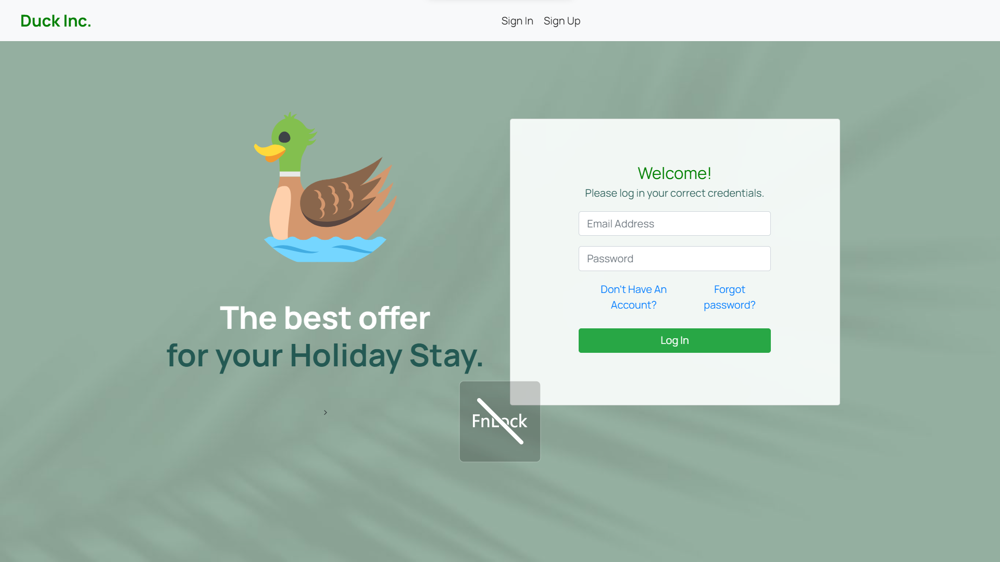
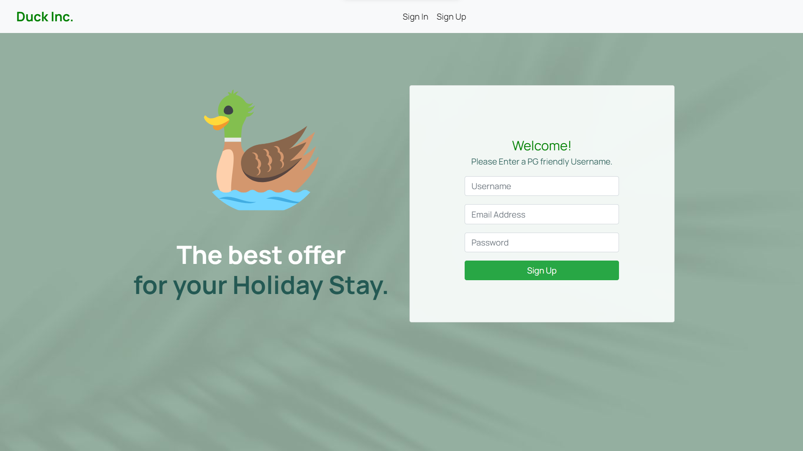
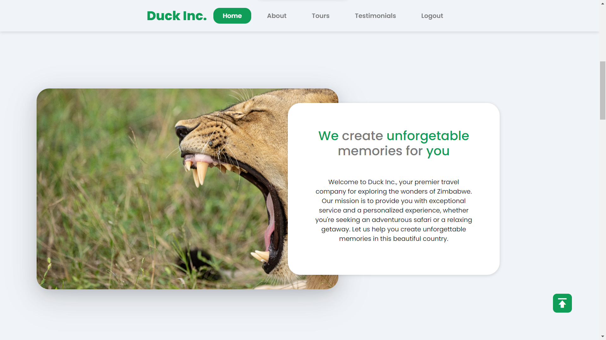
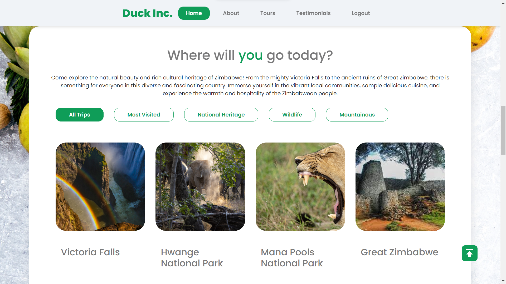

# Travel Website
Laravel Travel Website

         _   _              _   _                   _
        | | | | ___ _   _  | |_| |__   ___ _ __ ___| |
        | |_| |/ _ \ | | | | __| '_ \ / _ \ '__/ _ \ |
        |  _  |  __/ |_| | | |_| | | |  __/ | |  __/_|
        |_| |_|\___|\__, |  \__|_| |_|\___|_|  \___(_)
                    |___/

        Lookin' at the source code huh?
        Be sure to drop me a line! I'd love to chat,
        whether it's about code, design, ducks,
        gym, Basketball, or anything in between.

        - Dominic

<h3> Key Things to Note</h3>

     If you are using XAMPP you need to change the env file back to this
        
DB_CONNECTION=mysql 
DB_HOST=127.0.0.1 
DB_PORT=3306 
DB_DATABASE=custom 
DB_USERNAME=root 
DB_PASSWORD= 

MEMCACHED_HOST=127.0.0.1 

REDIS_HOST=127.0.0.1 
REDIS_PASSWORD=null 
REDIS_PORT=6379

